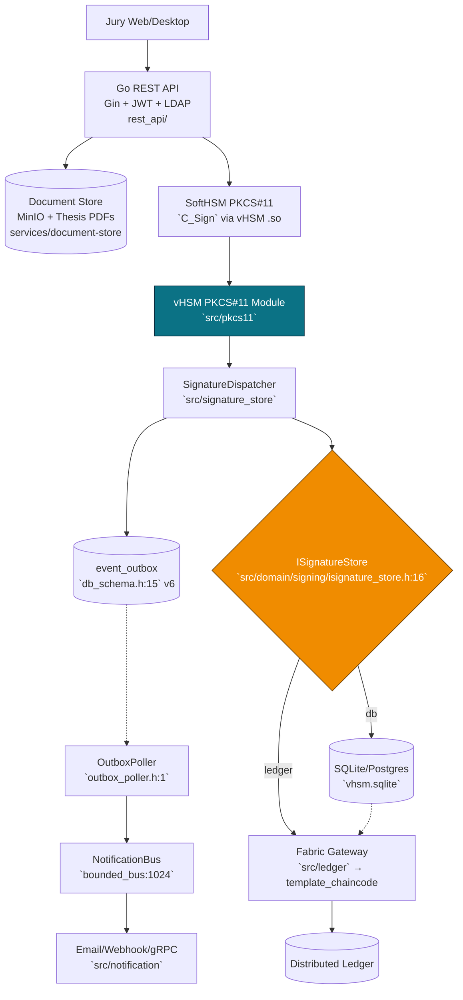

# vHSM — Architecture Review Document
**Version 1.0.0 — `dev` branch — 2026-08-23**
*For code review: one place to see the whole system, why it is shaped this way, and where the seams are.*

---

## 1. TL;DR for the reviewer

*   **What it is:** Virtual HSM that exposes a **PKCS#11** `.so` (`C_Sign`, `C_Verify`, …) and a **Go REST API** (`/api/v1/theses`), backed by **either** a file DB (`sqlite`/`postgres`) **or** a Hyperledger Fabric ledger (`template_chaincode`). Never both at once — `VHSM_STORE_BACKEND=db|ledger` (`CMakeLists.txt:14`, `composition_root.h:44`).
*   **Why DDD + PAL:** `src/domain` holds the ubiquitous language (`SignatureRecord`, `HsmInstanceId`, `ISignatureStore` port: `src/domain/signing/isignature_store.h:16`), `src/vhsm/infrastructure` hides `sqlite`/`Fabric`/`Win32` (`src/core/pal.h:23` `lock_memory`), `src/pkcs11/composition_root.h:40` `AppContainer` is the single composition root so `C_Initialize` is a thin adapter.
*   **Why the base ABI:** `src/abi/export.h:6` `VHSM_API` (`default`) vs hidden default (`-fvisibility=hidden`) + `[[nodiscard]] Result<T>` (`src/abi/result.h:1`) + `inline namespace vhsm::v1` lets the compiler LTO at `-O3 -flto` and makes `nm -D` auditable.

**Build & test (what to run in review):**
```bash
cmake --preset linux-ninja -DVHSM_STORE_BACKEND=db   # or ledger
cmake --build build -j4 && ctest --test-dir build -j1  # 271/271 (flaky ConcurrentSlotRegistration passes -j1)
./build/tests/unit/pkcs11/vhsm_composition_root_test  # 4 AppContainer tests
```

---

## 2. High-level — Jury → Go → HSM → Store



*Why the fork at `ISignatureStore`:* the old code stacked `DB` + `ledger` (`signature_records` had `ledger_tx_id/status` even when `backend=db`). Product requires **alternative** stores, so `AppContainer::backend` (`composition_root.h:44` `Db|Ledger`) picks one adapter (`DbStoreAdapter` vs `FabricStoreAdapter` in `src/domain/signing/adapters/`) — never both, no distributed commit.

---

## 3. DDD layers — where the code lives

```mermaid
flowchart LR
    subgraph Domain [src/domain — no infra includes]
        Kernel[kernel_types.h\nu8, version]
        PKCS11[pkcs11_types.h\nCK_*, CKM_*]
        Crypto[crypto_types.h\nSignResult, HashAlgorithm]
        Signing[signing/signature_record.h\nAggregate + mark_committed]
        Snap[token_snapshot.h\nValue object]
        Port[isignature_store.h\nISignatureStore port]
    end
    subgraph Application [src/pkcs11/composition_root.h:40]
        AppC[AppContainer\nowns db→bus→ledger→dispatcher→vault]
        Disp2[SignatureDispatcher\ntransactional outbox]
        Poller2[OutboxPoller]
    end
    subgraph Infra [src/... — depends on domain]
        Pal[core/pal.h\nVirtualLock/mlock]
        Vault[persistence/vault.cpp\nMoveFileExW/_commit]
        Wallet[wallet.cpp\nLockFileEx]
        Sqlite[signature_store/db_*]
        Fabric2[ledger/*]
        Notif[notification/*]
    end
    subgraph Interfaces [src/pkcs11, rest_api, firmware]
        P11[p11_init.cpp\nC_Initialize thin adapter]
        REST[Go Gin\nservices/document-store]
        FW[ESP-IDF firmware\nfirmware/]
    end
    Domain --> Application
    Application --> Infra
    Interfaces --> Application
```



*Forwarding shim:* `src/core/types.h:1` now only `#include "../domain/..."` for compat; new code includes `domain/*` directly. `target_include_directories(... PUBLIC ${PROJECT_SOURCE_DIR}/src)` (`src/*/CMakeLists.txt:15`) was tightened from `PUBLIC ${PROJECT_SOURCE_DIR}`.

---

## 4. Data flow — `C_Sign` through the outbox

```mermaid
sequenceDiagram
    participant App as PKCS#11 App
    participant P11 as C_Sign (p11_crypto.cpp)
    participant Disp as v_SignatureDispatcherCore_M1
    participant DB as SQLite (signature_records + event_outbox)
    participant Poller as OutboxPoller (500ms)
    participant Bus as BoundedNotificationBus
    participant Ledger as LedgerWorker (if backend=ledger)
    App->>P11: C_SignInit(CKM_ECDSA_SHA256) + C_Sign(data)
    P11->>Disp: v_dispatch(SignResult, slot, token, key)
    Disp->>DB: with_transaction { INSERT signature_records; INSERT event_outbox(PENDING) }
    Note over Disp,DB: atomic — crash between commit and publish does not lose event
    Disp-->>App: CKR_OK (does NOT wait for Fabric)
    Poller->>DB: SELECT * FROM event_outbox WHERE status='PENDING' LIMIT 32
    Poller->>Bus: publish(SIGN_CREATED) + UPDATE event_outbox SET DISPATCHED
    Bus->>Ledger: (if ledger backend) submit_record → FabricStoreAdapter → LedgerClient::submit_record → template_chaincode NotarizeDocument
```

*Why outbox:* `v1..v5` did `insert` then `bus.publish` then `ledger.submit` outside the DB transaction — crash between commit and publish lost the notification. `v6` (`db_schema.cpp:120` `event_outbox`, `signature_dispatcher_core.cpp:31` `with_transaction`) makes `SIGN_CREATED` durable; the poller (`outbox_poller.h:1`) replays on `C_Initialize` and on timer.

---

## 5. Store backends — mutually exclusive

```mermaid
flowchart LR
    Env[VHSM_STORE_BACKEND=db|ledger\n+ VHSM_DB_PATH / VHSM_LEDGER_*] --> Comp[AppContainer::backend\ncomposition_root.cpp:157]
    Comp -- db --> DBPath[resolve_db_path_for_container()\n~/.vhs/vhsm.sqlite or %LOCALAPPDATA%\\vHSM — p11_init.cpp:89 delegates]
    Comp -- ledger --> FabricCfg[resolve_fabric_config_dir()\n/etc/vhsmd → network/Conf_with_fabric-CA fallback\ncomposition_root.cpp:104]
    DBPath --> DbStore[DbStoreAdapter\nSignatureRepository]
    FabricCfg --> FabStore[FabricStoreAdapter\nLedgerClient → template_chaincode]
    DbStore --> StorePort[ISignatureStore store\ncomposition_root.h:81]
    FabStore --> StorePort
    StorePort --> Disp3[SignatureDispatcher]
```

*Prod vs dev:* `/etc/vhsmd` (`crypto/peers/.../msp/tls`, `users/Admin/...`, `default-fabric.conf`, `vhsmd.env` — your `tree`) is **generated** by `Conf_with_fabric-CA` scripts; code defaults to `/etc/vhsmd` and falls back to `network/.../Conf_with_fabric-CA` when absent (`composition_root.cpp:104`).

---

## 6. Base ABI + peak compiler

```mermaid
flowchart TB
    ABI[src/abi/export.h:6\nVHSM_API/HIDDEN, VHSM_NODISCARD\nVHSM_NOINLINE_HIDDEN,\ninline namespace v1] --> Result[src/abi/result.h:1\nResult<T>=expected<T,error_code>]
    Result --> Error[src/abi/error.h:1\nErrc DeviceError]
    ABI --> Span[src/abi/span.h:1\nByteSpan]
    ABI --> Flags[Top-level CMakeLists.txt\n-Wall -Wextra -Werror -fstack-protector-strong\n-D_FORTIFY_SOURCE=2 -fPIC, relro/now + PIE]
    ABI --> Vis[cmake/CompilerFlags.cmake\nvhsm_target_hardening: per-target\n-fvisibility=hidden/inlines-hidden]
    Flags --> LTO[VHSM_ENABLE_IPO: CMake-managed LTO\n(CMAKE_INTERPROCEDURAL_OPTIMIZATION_<CONFIG>)\ndevirtualizes hidden symbols; Debug stays -O0]
    Result --> Nodiscard[[nodiscard]] --> Compiler[Compiler enforces handling]
```

*Usage:* `src/core/utils.h:16` `try_uuid_v4() -> vhsm::v1::Result<string>` is the first ABI-friendly overload (never throws across `C_Initialize`/`C_Sign`). New code should return `Result` instead of throwing.

---

## 7. Windows PAL — what changed

| Before (POSIX-only) | After (`src/core/pal.h:23`) |
|---|---|
| `src/core/secure_buffer.h:10` `#include <sys/mman.h>` unconditional | `#ifdef _WIN32` `windows.h` / `VirtualLock` else `mman.h`/`mlock` (`secure_buffer.cpp:44` stray `}` fixed) |
| `src/persistence/vault.cpp:3` `open/fsync/rename/getpid` | `MoveFileExW` + `_commit` + `_getpid` (`vault.cpp:155`) |
| `src/keystore/key_wrap.cpp:7` `mlock` | `VirtualLock` branch |
| `wallet.cpp:21` `flock` | `LockFileEx` (`wallet.cpp:21` `CreateFileW` + `LockFileEx`) |
| `src/crypto/SecureRNG.cpp:5` `mlock` + `ctr_drbg_aes256.cpp:103` `/dev/random` | `VirtualLock` + `BCryptGenRandom` (`ctr_drbg_aes256.cpp:103`) |
| `src/core/ClockUtils.h:55` `gmtime_r` only | `gmtime_s` on `_WIN32` |
| `src/pkcs11/p11_init.cpp:89` `HOME/.vhs` | `%LOCALAPPDATA%\vHSM` fallback |

---

## 8. Versioning

*   `CMakeLists.txt:2` `project(VirtualHSM VERSION 1.0.0)` → `generated/vhsm/version.h` (`VHSM_VERSION_MAJOR/MINOR`) — `C_GetInfo` (`p11_init.cpp:270`) returns it.
*   `vcpkg.json:1` + `CMakePresets.json:1` (`linux-ninja`, `release`, `windows-msvc`, `asan`) + `CHANGELOG.md:1` (Keep a Changelog).
*   `git tag v1.0.0` not yet pushed — do after review.

---

## 9. Directory map (after extraction)

```
src/abi/            base ABI (export/result/error/span)
src/domain/         kernel, pkcs11_types, crypto_types, signing/record, isignature_store + adapters
src/core/           pal.h, hsm_instance (HsmInstanceId + DB provider), secure_buffer
src/pkcs11/         composition_root (AppContainer), p11_init thin adapter
services/document-store  Go Gin + MinIO (ex src/document_store)
services/ai-stor         Haskell (ex src/ai_stor)
firmware/                ESP-IDF (ex src/firmware, build/ ignored)
network/fabric_configuration/Conf_with_fabric-CA  → generates /etc/vhsmd
network/fabric_configuration/template_chaincode    chaincode (Thesis lifecycle)
```

---

## 10. How to read the code in review order

1.  `src/abi/export.h:1` → `src/domain/signing/isignature_store.h:16` → `src/domain/signing/signature_record.h:1` (port)
2.  `src/pkcs11/composition_root.h:40` + `composition_root.cpp:153` (wiring, `VHSM_STORE_BACKEND` switch)
3.  `src/signature_store/internal/signature_dispatcher_core.cpp:31` (outbox transaction) + `outbox_poller.h:1` + `db_schema.h:15` `v6`
4.  `src/core/pal.h:23` + `src/persistence/vault.cpp:155` + `wallet.cpp:21` (Windows)
5.  `tests/unit/pkcs11/composition_root_test.cpp:1` (4 `AppContainer` tests with `:memory:`)

Run `ctest -j1 --output-on-failure` — expect 271/271 (flaky `ConcurrentSlotRegistration` passes `-j1`).

---

*Generated for review — diagrams are Mermaid, renderable on GitHub/GitLab. Source: `dev` at `bfe33e0`..`a7c2ee4` series.*
