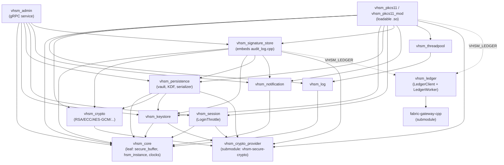
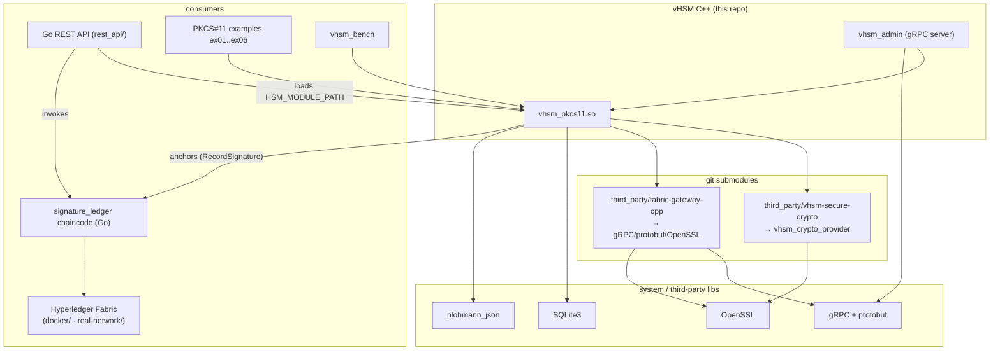

# vHSM Dependency Graph

How the vHSM modules, third-party submodules, and external consumers depend on
each other. Two views:

1. **Build/module graph** — C++ `add_library` targets and their
   `target_link_libraries` edges (from `src/*/CMakeLists.txt`).
2. **System/runtime graph** — the loadable `.so`, the Go REST API, the Fabric
   chaincode, and the two git submodules.

> Edges marked `VHSM_LEDGER` are compiled in **only** when CMake is configured
> with `-DVHSM_LEDGER=ON` (the Fabric anchoring path).

## 1. Build / module dependency graph



Notes:
- `vhsm_core` is the root leaf (no internal deps; links `bcrypt` only on
  Windows, and transitively OpenSSL via `vhsm_crypto_provider`).
- **Audit** is *not* a separate library: `src/audit/audit_log.cpp` is compiled
  directly into `vhsm_signature_store` (`src/signature_store/CMakeLists.txt:18`),
  so the hash-chained audit log is part of the signature store.
- `vhsm_pkcs11` is built both as an OBJECT lib and as the shared module
  `vhsm_pkcs11_mod` (the PKCS#11 `.so`); both share the same link set.
- `vhsm_admin` adds `protobuf::libprotobuf` + `gRPC::grpc++` (proto codegen from
  `hsm_admin.proto`).

## 2. System / runtime dependency graph



Notes:
- The C++ core is a **library** (`libvhsm_pkcs11.so`) loaded by PKCS#11
  consumers. The Go REST API points `HSM_MODULE_PATH` at it and also talks to
  the same Fabric chaincode (`signature_ledger`) that `vhsm_ledger` anchors to.
- `vhsm-secure-crypto` and `fabric-gateway-cpp` are **pinned git submodules**
  under `third_party/` — remember to push the submodule before the superproject
  (see `docs/FABRIC_CHAINCODE.md`, "Submodules and the push workflow").
- `vhsm_bench` and the `examples/pkcs11` executables link the same `.so`.

## How to regenerate / verify

The graph above is derived from the `target_link_libraries` calls in
`src/*/CMakeLists.txt`. To re-check after build changes:

```bash
rg -n "target_link_libraries\(" --glob 'CMakeLists.txt' src -A6
```

Or render the Graphviz version (`docs/dependency_graph.dot`) with:

```bash
dot -Tsvg docs/dependency_graph.dot -o dependency_graph.svg
```
