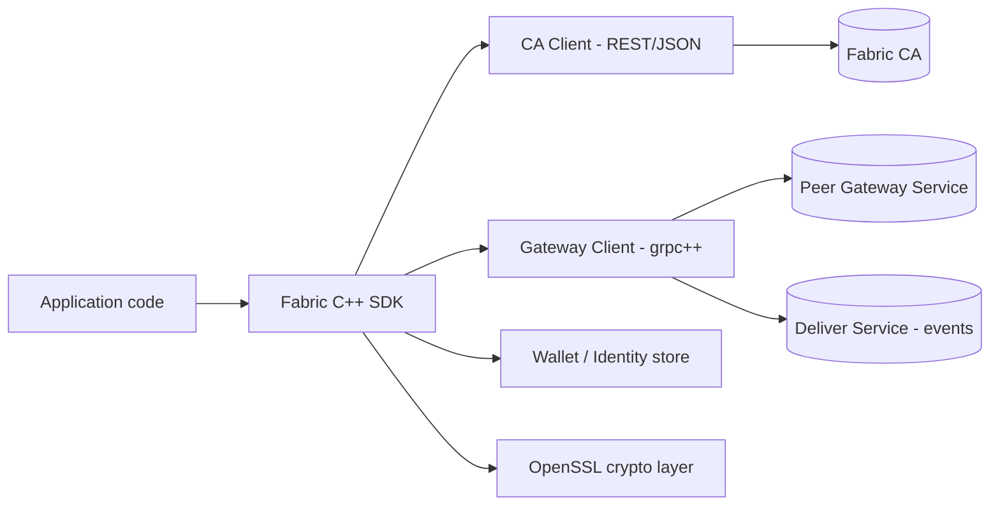

# Hyperledger Fabric C++ SDK — Implementation Plan

## 1. Goals

- C++ client SDK for Hyperledger Fabric with an API shape similar to the official fabric-gateway SDKs (Go/Node/Java): `Gateway` → `Network` → `Contract` → `submitTransaction` / `evaluateTransaction`.
- All peer/orderer/gateway communication over **grpc++** (the protocol Fabric actually speaks), targeting the Fabric Gateway service (2.4+) as the primary transaction path.
- Identity lifecycle via Fabric CA, over a small, swappable REST client.
- Consistent TLS/mTLS handling across both layers.

## 2. Architecture



- **gRPC layer (`grpc++` + `protobuf`)** — Gateway service (Endorse/Submit/Evaluate/CommitStatus), Deliver service (block/chaincode events), Discovery service if needed. Stubs generated from vendored `hyperledger/fabric-protos`.
- **REST layer (transport-agnostic)** — Fabric CA only (enroll/register/reenroll/revoke). Implemented behind an `HttpClient` interface so the concrete library (libcurl, cpp-httplib, Boost.Beast, etc.) is swappable without touching the rest of the SDK.

## 3. Dependencies

| Purpose                                    | Library                                                                   |
| --------------------------------------------| ---------------------------------------------------------------------------|
| Peer/orderer/gateway RPCs, event streaming | grpc++ / protobuf                                                         |
| Fabric CA REST calls                       | any HTTP client behind `HttpClient` interface (e.g. libcurl, cpp-httplib) |
| Crypto, X.509, CSR, signing                | OpenSSL                                                                   |
| JSON (CA payloads)                         | nlohmann/json                                                             |
| Connection profiles                        | yaml-cpp                                                                  |
| Build                                      | CMake (3.20+)                                                             |
| Package management                         | vcpkg or Conan                                                            |
| Testing                                    | GoogleTest                                                                |

## 4. Directory Layout

```
fabric-cpp-sdk/
  CMakeLists.txt
  include/fabric/
    ca/            # Fabric CA REST client
    crypto/        # keygen, CSR, X.509, signing helpers
    identity/      # wallet, identity types
    grpc/          # connection/channel management, error mapping
    gateway/       # Gateway service client + high-level Contract API
    events/        # Deliver service client
    config/        # connection profile parsing
  src/             # implementation files mirroring include/
  proto/           # vendored fabric-protos .proto files (submodule or pinned snapshot)
  generated/       # protoc/grpc_cpp_plugin output (gitignored)
  third_party/     # or vcpkg manifest / conanfile
  examples/        # enroll-and-invoke sample app
  tests/
```

## 5. Tasks by Phase


### Phase 0 — Project Setup & Tooling
- [x] Initialize CMake project (C++17/20) with the directory layout above
- [x] Add vcpkg/Conan manifest pinning grpc, protobuf, openssl, nlohmann-json, yaml-cpp, gtest
- [x] Vendor `hyperledger/fabric-protos` (git submodule or pinned snapshot) — peer, common, msp, gateway, orderer `.proto` files
- [x] Wire up CMake protobuf/grpc codegen (`protoc` + `grpc_cpp_plugin`) producing stubs into `generated/`
- [x] Set up CI (Linux/macOS, Debug/Release build matrix)
- [x] Smoke test: trivial grpc++ client/server build to confirm toolchain end-to-end

### Phase 1 — Crypto & Identity Layer
- [x] OpenSSL wrapper: EC keypair generation (P-256, Fabric's default curve)
- [x] CSR (PKCS#10) generation for enrollment
- [x] X.509 certificate parsing/validation helpers
- [x] `Identity` type: `{ mspId, certificate (PEM), privateKey (PEM) }`
- [x] ECDSA signing helper over arbitrary bytes (used later for proposal/transaction signing)
- [x] Wallet interface + `InMemoryWallet` + `FileSystemWallet` implementations
- [ ] Unit tests: keygen, CSR, sign/verify round-trip

### Phase 2 — Fabric CA Client (REST)
- [ ] Define `HttpClient` interface; implement one concrete backend (libcurl or cpp-httplib)
- [ ] `Enroll` (basic auth, parse returned cert + CA chain)
- [ ] `Register` (token auth derived from prior enrollment)
- [ ] `Reenroll`, `Revoke`
- [ ] `GetCAInfo`, `GetCertificates`
- [ ] TLS verification against CA's TLS cert (configurable trust bundle)
- [ ] Integration test against a local `fabric-ca-server` (Docker)

### Phase 3 — gRPC Transport Layer
- [ ] Confirm generated stubs build for: Gateway service, Deliver service, MSP/common/peer messages
- [ ] `GrpcConnection` wrapper: channel creation with mTLS credentials (client cert/key, server CA cert, optional hostname override for test networks)
- [ ] Reconnect/backoff logic for dropped channels
- [ ] Map `grpc::Status` codes to SDK exception hierarchy (`EndorsementError`, `CommitError`, `TimeoutError`, etc.)
- [ ] Unit/connectivity test against a local peer (test-network)

### Phase 4 — Gateway Client (Endorse / Submit / Evaluate / CommitStatus)
- [ ] Construct chaincode proposal (`ChaincodeInvocationSpec` → signed `Proposal`), using the Identity layer for signing
- [ ] Implement `Evaluate` RPC (query path, no ordering)
- [ ] Implement `Endorse` RPC, collect endorsement responses from the Gateway
- [ ] Assemble signed transaction envelope from endorsements; implement `Submit` RPC
- [ ] Implement `CommitStatus` (poll or streaming variant)
- [ ] Retry/backoff policy for transient failures (e.g. `MVCC_READ_CONFLICT`)
- [ ] Integration tests against `fabric-samples` test-network using `asset-transfer-basic` chaincode

### Phase 5 — High-Level Developer API
- [ ] `Gateway` class: `connect(identity, endpoint, tlsCredentials)`
- [ ] `Network` class: `getContract(channelName, chaincodeName)`
- [ ] `Contract` class: `evaluateTransaction(name, args...)`, `createTransaction(name).submit(args...)`
- [ ] Transaction/proposal builder supporting transient data and endorsing-org overrides
- [ ] Async submit + commit-listener callback variant
- [ ] Example app: enroll via CA → submit + evaluate against `asset-transfer-basic`

### Phase 6 — Event Service
- [ ] Deliver service streaming client (server-streaming gRPC)
- [ ] Block decoding → filtered transactions / chaincode events
- [ ] Chaincode event listener API with checkpoint/replay-from-block-number support
- [ ] Reconnect-and-resume logic on stream drop
- [ ] Integration test: listen for events emitted by an example chaincode invocation

### Phase 7 — Discovery (optional)
- [ ] Discovery service client (only if bypassing the Gateway's built-in endorser routing)
- [ ] Peer/endorser query per channel
- [ ] Cache discovery results with TTL

### Phase 8 — Testing, Docs, Packaging
- [ ] Full integration suite against `fabric-samples` test-network (CI spins it up via Docker)
- [ ] API reference docs (Doxygen)
- [ ] Usage guide + populated `examples/`
- [ ] CMake install/export targets for downstream consumption
- [ ] vcpkg/Conan port definition
- [ ] Versioning policy tied to the vendored `fabric-protos` version

## 6. Open Decisions (Answered)

- Target Fabric Gateway gRPC API (2.4+, recommended).
- Concrete REST backend for Phase 2: Boost.Beast.
- Wallet backends beyond file/in-memory (e.g. PKCS11/HSM) — defer to a later phase if needed.
- Which Fabric version's `fabric-protos` to vendor against, and the process for pulling in proto updates over time.